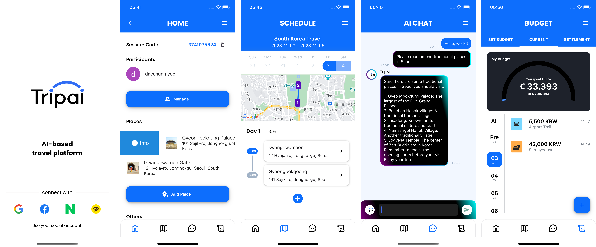

# Tripai: Graduation Project - SKKU, 2023

AI-Based Travel Platform & Service

## Preview

## Progress Plan

- [x] Users can access Travel-AI in iOS.
- [x] Users can access Travel-AI in Android.
- [x] Users can sign in to Travel-AI.
  - [x] Users can sign in to Travel-AI with Google Oauth.
  - [x] Users can sign in to Travel-AI with Naver Oauth.
  - [x] Users can sign in to Travel-AI with Kakao Oauth.
  - [x] Users can sign in to Travel-AI with Facebook Oauth.
- [x] Users can sign out from Travel-AI.
- [x] Users can register budget data manually to save and manage budget during travel.
- [x] Users can convert receipt image as data form to save and manage budget during travel.
- [x] Users can lookup previous conversion histories.
- [x] Users can check summary of settlements and usage of budget with current state.
- [x] Users can make group each other to share single travel session.
- [x] Users in session can share conversion or other information each other, in real-time.
- [x] Users in session can share GPT conversation each other, in real-time.
- [x] Users can share their session data in real-time.
  - [x] Users can share their budget data in real-time.
  - [x] Users can share their settlement data in real-time.
  - [x] Users can share their schedule data in real-time.
  - [x] Users can share session members' data in real-time.
- [x] Users can add friend each other.
- [x] Users can invite other users to session.
- [x] Users can interact with GPT as text input to resolve their troubles during travel.

## API Lists

- [move to notion](https://dear-knife-508.notion.site/New-API-265f13a33fcb4daba56197eeaa21bad2?pvs=4)

## Members

- 2017311067, Software Dept, YoungHoon Jo (Back-end)
- 2016313532, Computer Science & Engineering Dept, HanYoung Lee (Front-end)
- 2015312774, Computer Science & Engineering Dept, DaeChung Yoo (Front-end)

## Subject

AI-based travel expense tracking and trouble guide service development

## Technical Stacks

### Major Stacks

- OCR (Optical Character Recognition)
- OpenCV (Open Source Computer Vision Library)
- ChatGPT (GPT-4)

### Backend

- Golang
- MySQL
- Redis
- Websocket

### Frontend

- React Native
- Websocket
- OAuth 2.0 SDKs (Google, Naver, Kakao, Facebook)

## Budget

|     Entry      |      Costs      | Real Costs |
| :------------: | :-------------: | :--------: |
|  ChatGPT API   |    15~30 USD    | 0.55 USD/M |
| Remote Hosting |  8.3~16.7 USD   | 64.3 USD/M |
|     Total      | about 23~45 USD | 64.9 USD/M |

## Reason of Project

Before traveling, during the planning stage, information for flights,
accommodation, meals, and sightseeing must be found within a fixed budget,
which is one of the factors that require more time and effort. In addition,
during the trip, periodic budget management is necessary to prevent the
budget from being exceeded due to unforeseen costs. In particular, in cases
such as overseas travel where cash is often used, there is the inconvenience of
reduced accuracy and speed as manual entries are common in general
household budgeting.\
To solve this problem, we propose a service that provides travel information
suitable for the budget using AI, organizes household accounts easily using
automation technology, and helps with budget management through AI
analysis. Therefore, the purpose of this project is to develop an AI-based travel
assistance service that allows for easy management of travel budgets.
